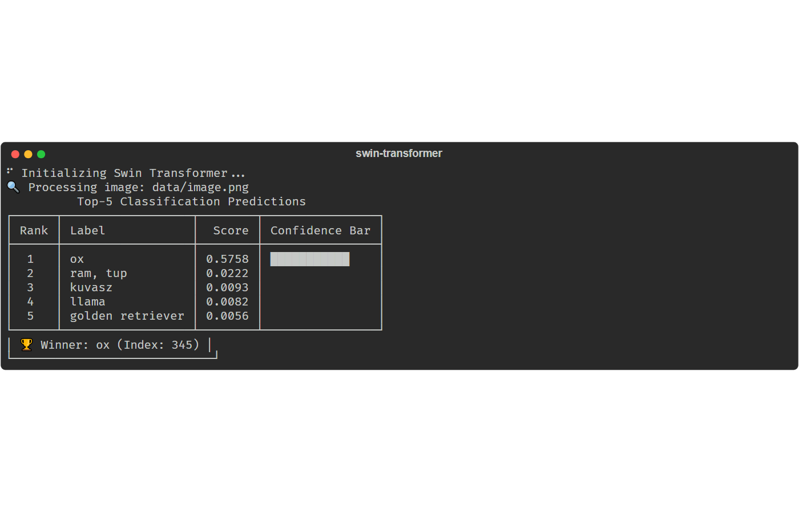

# Swin Transformer Image Classifier

[](https://github.com/IGORSVOLOHOVS/swin-transformer/actions/workflows/ci.yml)
[](LICENSE)
[](pyproject.toml)
[](docs/quality-iso25010.md)


A professional, domain-driven Python implementation of image classification using the Swin Transformer (`microsoft/swin-tiny-patch4-window7-224`).

## 🚀 Key Features
- **Clean Architecture**: Strict separation of concerns (Domain, Application, Infrastructure).
- **DDD Principles**: Ubiquitous language, Value Objects, Entities, and Ports/Adapters.
- **Monadic Error Flow**: explicit error handling via `Result` pattern (no exceptions).
- **Rich Observability**: Professional terminal UI and structured logging using `rich`.
- **High Performance**: Optimized inference pipeline with a latency baseline of ~100ms on CPU.
- **Strict Typing**: Python 3.10+ type hints with `mypy --strict` compliance.

## 📁 Structure
- `src/swin_classifier/`
  - `domain/`: Core models and interfaces (Protocols).
  - `application/`: Use cases (ClassifyImageService).
  - `infrastructure/`: External integrations (HuggingFace, Local IO).
  - `main.py`: Entry point and CLI logic.
  - `result.py`: Monadic Result type implementation.
- `tests/`: Pytest suite with fixtures and performance benchmarks.
- `docs/api/`: Auto-generated API documentation.

## 🖼️ Example Result

### Input Image


### Classification Output
```text
🔍 Processing image: data/image.png
          Top-5 Classification Predictions
┏━━━━━━┳━━━━━━━━━━━━━━━━━━┳━━━━━━━━┳━━━━━━━━━━━━━━━━┓
┃ Rank ┃ Label            ┃  Score ┃ Confidence Bar ┃
┡━━━━━━╇━━━━━━━━━━━━━━━━━━╇━━━━━━━━╇━━━━━━━━━━━━━━━━┩
│  1   │ ox               │ 0.5758 │ ███████████    │
│  2   │ ram, tup         │ 0.0222 │                │
│  3   │ kuvasz           │ 0.0093 │                │
│  4   │ llama            │ 0.0082 │                │
│  5   │ golden retriever │ 0.0056 │                │
└──────┴──────────────────┴────────┴────────────────┘
╭────────────────────────────╮
│ 🏆 Winner: ox (Index: 345) │
╰────────────────────────────╯
```

## 🛠️ Usage

### Installation
Ensure you have the dependencies installed:
```bash
pip install transformers torch Pillow numpy rich pdoc pytest
```

### Running Classification
Classify the default image:
```bash
python classify_image.py
```

Classify a specific image:
```bash
python classify_image.py data/image.png
```

### Testing & Quality
Run unit tests:
```bash
$env:PYTHONPATH='src'; python -m pytest tests/
```

Run performance benchmarks:
```bash
$env:PYTHONPATH='src'; python -m pytest tests/test_perf.py -s
```

## 📊 Performance Baseline
- **Model**: Swin-Tiny
- **Device**: CPU
- **Avg Latency**: ~101 ms
- **Confidence**: Structured Top-5 output.

### Everything around the model

Inference is the model's cost, not this repository's. What a change here can
actually make slower is the work surrounding it, measured by
`benchmarks/test_pipeline_performance.py` — median of many rounds:

| What is measured | Median |
| --- | ---: |
| Load and decode a 64 × 64 PNG | 156.3 µs |
| Load and decode a 224 × 224 PNG | 830.1 µs |
| Load and decode a 1024 × 1024 PNG | 15.79 ms |
| Missing file — the failure path | 13.0 µs |
| Use case: load + orchestrate, model stubbed | 746.0 µs |

Two things fall out of these numbers. The use case costs 746 µs against 830 µs
for the load it contains, so the layering — ports, `Result` objects, the service
indirection — is lost in the noise of decoding: **the architecture is not what
is slow.** And decoding is linear in image area, so a 1024 × 1024 input spends
~16 ms before the model sees anything; downscale large inputs first.

The failure path costs 13 µs, sixty times less than a successful load, because a
missing file is a `Path.exists()` check rather than an exception unwind.

```bash
pytest benchmarks --benchmark-only
```

## 📝 License
MIT

## 🖥️ Real output



Captured from an actual run, not mocked up. Regenerate it with
`python scripts/capture_usage_screenshots.py`.

## 📦 Install and run

```bash
pip install -e .
swin-classify data/image.png      # or any path
swin-classify                     # uses the bundled sample
```

## ✅ Quality

| Control | Command | In CI |
| --- | --- | --- |
| Tests and coverage | `pytest --cov` | yes, fails below 90% |
| Lint and format | `ruff check . && ruff format .` | yes |
| Types | `mypy` | yes, `--strict` over `src/` |
| Secret scan | `gitleaks` | yes, over full history |
| Branch policy | `python scripts/enforce_branch_policy.py` | yes |

Assessment against ISO/IEC 25010, including the gaps:
[`docs/quality-iso25010.md`](docs/quality-iso25010.md).
Design and its trade-offs: [`docs/architecture.md`](docs/architecture.md).

## 🌿 Branches

Exactly three: `release`, `dev`, `test`. See
[`docs/branching.md`](docs/branching.md).

## 📄 License

MIT - see [`LICENSE`](LICENSE). Copyright (c) 2026 Igors Volohovs.
